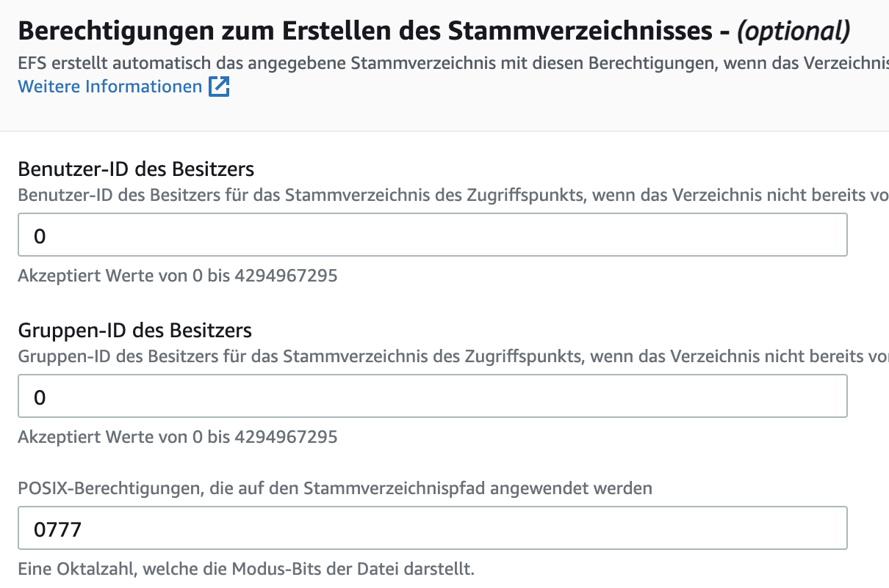

# Usecase Datalake

## Beschreibung

Ziel ist es ein mittels serverless Funktionen einen Datalake zu erstellen, der strukturierte und unstrukturierte Datensätze speichern kann.

## User Stories

> Als Datawarehouse Admin möchte ich
>
> die Möglichkeit Datensätze aus Quellsystemen egal welcher Form zwischen zu speichern,
>
> damit die Rohdaten quasi archiviert werden.

> Als Datawarehouse Admin möchte ich
>
> das die Lösung Serverless umgesetzt wird,
>
> damit eventuelle Lastspitzen abgefangen werden ohne das Server ausgelastet werden.

## Architektur 


Es wird ein API Gateway erstellt welches den Pfad `/filesystem` öffentlich zugänglich macht.
Alle weiteren Pfade dahinter dienen für das Dateisystem als Speicherpfad.
Das Speichern und Lesen wird hierbei von einer Lambda funktion übernommen, damit Lastspitzen gut abgefangen werden können.

## Aufsetzen

### Source Code Compilieren

> Nur notwendig wenn Änderungen am Code vorgenommen wurden.

Es muss Go auf dem entsprechenden System installiert sein.
Installationsanweisungen können [hier gefunden werden.](https://golang.org/doc/install)

Nun muss in den Ordner `./cc3-aws/datalake/writereadfs` navigiert werden.
Dort wird der folgende Befehl ausgeführt:

```bash
env GOOS=linux GOARCH=amd64 go build -o main ./main.go && zip -r main.zip main
```

Dieser Baut aus dem vorhandenen Sourcecode eine Binary für die Zielplattform `linux`.
Diese Binary mit dem Namen `main` wird als `main.zip` Archiv verpackt.

### File System (EFS)

Als erstes muss ein neues Dateisystem erstellt werden, welches dann in die Lambda Funktion gemounted wird.
Ein Dateisystem kann unter EFS erstellt werden.
Dabei muss ein Name vergeben werden und ein VPC festgelegt werden.
Die spätere Lambda muss in dem gleichen VPC und in der gleichen Region sein!


Sobald diese erstellt ist muss ein Zugriffspunkt für die Lambdas erstellt werden.
Hierzu wird das Wurzelverzeichniss verwendet.
Da das Wurzelverzeichnis von root erstellt wird muss der Nutzer 0 der Gruppe 0 angegeben werden.




Das Dateisystem ist hiermit eingerichtet.

### Lambda Funktion

Als nächstes muss eine Lambda Funktion angelegt werden.
Bei dieser muss die Go Runtime festgelegt werden und das VPC eingerichtet werden.
Das VPC, die Subnetze und die Sicherheitsgruppe kann unter `Erweiterte Einstellungen` beim erstellen der Lambda eingerichtet werden.


Danach muss noch der Handler von der Lambda umgestellt werden, da die Go Binary main heißt.


Dann kann unter `Konfiguration` > `Dateisysteme` > `Dateisystem hinzufügen` das erstellte EFS eingebunden werden.
Dabei wird der erstellte Zugriffpunkt genutzt und als mount-Pfad wird `/mnt/datalake` genutzt.

> Für einen anderen Pfad müsste der Code angepasst werden.


Danach kann in der Lambdafunktion unter dem Reiter `Code` mit dem Button `Hochladen von` die erstellte / vorhandene ZIP-Datei hochgeladen werden.
Damit ist die Lambda funktion eingerichtet.

### API Gateway 

Als letztes muss ein API Gateway vom Typen `REST API` angelegt werden.
Dort muss dann eine neue Ressource erstellt werden, welche den Pfad `/filesystem` an Anfang beinhaltet.
Zusätzlich wird diese Ressource als Proxyressource definiert, dass heißt alle Subpfade führen zum gleichen Endpunkt.
Alles nach `/filesyste` dient dann als Pfad zum speichern des Datensatzes.


Diese Proxy Ressource legt eine `ANY` Method an und muss dann mit dem erstellten Lambda verbunden werden.


Am Ende sollte der Pfadbaum so aussehen:


Das API Gateway kann dann z.B. mit der Stufe `test` bereitgestellt werden.

## Testen

Folgender Curl Befehl schreibt im unter `/test/test.json` eine Datei mit dem JSON 

```json
{
    "test": 123
}
```

Es sollte ein Response mit dem Statuscode 200 und dem Text `File written to filesystem.` zurück kommen.

```bash
curl -X POST https://mpb01j9z52.execute-api.eu-central-1.amazonaws.com/test/filesystem/test/test.json -d {"test":123}
```

Dieser Befehl lädt die gerade gespeicherten Daten.

```bash
curl -X GET https://mpf01i9z12.execute-api.eu-central-1.amazonaws.com/test/filesystem/test/test.json
```

## Probleme 

### Zugriffspfad Wurzelverzeichnis

Wenn das Wurzelverzeichniss als Zugriffspfad bei einem EFS verwendet wird müssen die Permissions und Users so gewählt werden, dass es sich um root handelt.
Das liegt daran, dass das Root-Verzeichniss vom root nutzer erstellt wurde.

### Subpfade abfangen

Subpfade können nur mit einem `{proxy+}` abgefangen werden.
Dies nimmt einen aber die Möglichkeit Lambdas für einzelne Request-Methoden zu schreiben, da immer eine `ANY` Methode angelegt wird.

### Zonen, Regionen und VPC

Die Lambda muss im gleichen VPC / in den gleichen Regionen wie das EFS liegen.
Sollte das EFS nur für die die Zone A existieren, die Lambda allerdings in allen drei Zonen dann kann diese das Dateisystem nicht mounten.
Das liegt daran, dass die Lambda theoretisch in Zone B gestartet werden kann, wo sie kein Zugriff auf das EFS hätte.

## Erweiterungspotential

### Absichern der API mittels Cognito

Dadurch wird sichergestellt, dass nut verifizierte Nutzer Zugriff auf die Daten haben.

### Anbinden weiterer Lambdas und Speichermöglichkeiten

Nach dem Pfad oder intelligent in den Lambdas könnte erkannt werden ob es sich bei den Daten z.B. um strukturierte Datensätze handhabt.
Dadurch könnte der Speicherort dynamisch gewählt werden.

JSON -> DynamoDB

Tabellen Daten -> RDS

große Dateien -> S3

kleine Dateien -> ES
