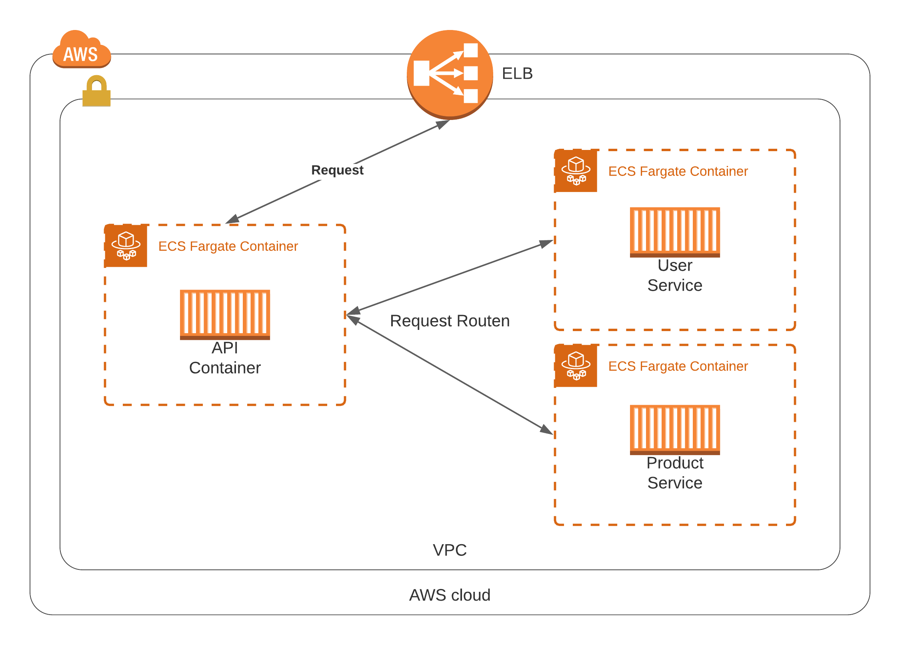
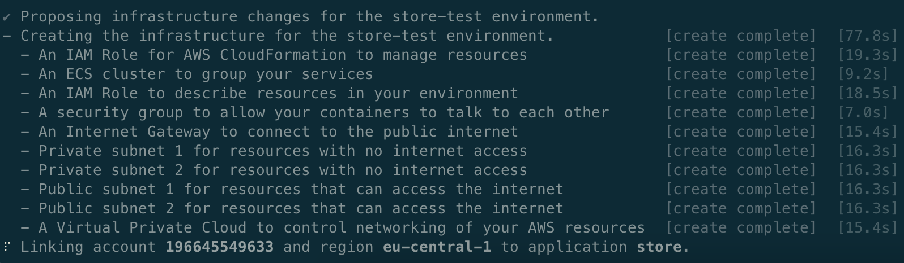

# Usecase Fargate + Copilot

## Beschreibung

Ziel ist es mittels Fargate und dem CLI Tool Copilot eine Microservice Architektur zu erstellen.

## User Stories

> Als Entwickler möchte ich
>
> eine PaaS wo Microservices mittels Container Images bereitgestellt werden können,
>
> damit Releases schnell ausgeführt werden können.

> Als Entwickler möchte ich
>
> unabhängig von IT-Personal Änderungen bereitstellen können,
>
> damit keine Verzögerungen im Entwicklungsprozess durch Wartezeiten auftreten.

## Architektur 

Mit Hilfe des Copilot CLI Tools wird eine solche Architektur automatisch bereitgestellt.
Die einzelnen Services werden mit Hilfe von Fargate (ECS) skallierbar deployt.
Das Bereitstellen erfolgt in einem eingenen neu angelegten VPC mit eigenem ELB.
Einer der Services dient hierfür als API Gateway und leitet Requests an die entsprechenden Microservices weiter.



## Aufsetzen

### AWS-CLI

Anweisungen zum installieren der CLI für die entsprechenden Betriebssysteme können hier gefunden werden.

https://docs.aws.amazon.com/cli/latest/userguide/install-cliv2.html

Nach erfolgreicher Installation muss die CLI noch eingerichtet werden. 
Mit folgendem Befehl kann eine Referenz auf einen AWS Account hergestellt werden.
```bash
aws configure
```

### Copilot-CLI installieren

Entsprechende Anweisungen sind hier zu finden.

https://docs.aws.amazon.com/AmazonECS/latest/developerguide/AWS_Copilot.html#copilot-install

### Docker installieren

Docker wird zum bauen der Container Images benötigt.
Copilot bietet leider keine Möglichkeit einen Build Server mit Podman zu nutzen, dementsprechend muss docher leider noch lokal installiert sein.

Alle wichtigen Schritte sind in der Docker Dokumentation beschrieben.

https://docs.docker.com/get-docker/

### Copilot App Beschreibung

Copilot benutzt Cloud Formation und Fargate um pro App ein eigenständiges System bereitzustellen.
Bei drei Microservices benötigt es genau vier Befehle zum bereitstellen des gesamten Systems.

> Alle Schritte werden jetzt erklärt sind aber für das Beispiel in dem Bashscript copilotw.sh zusammengefasst.
> Dazu danach mehr.

Um eine app zu initialisieren muss `copilot app init NAMEDERAPP` ausgeführt werden.
Dadruch wird das `copilot` Verzeichniss angelegt, welches entsprechende Konfigurationen für die App und spätere Services beinhaltet.

Nun müssen alle Microservices initalisiert werden.
Dabei unterscheiden wir öffentliche Microservices, wie der API-Service, und backend services, welche am ende die Logik halten.

Der folgende Befehl stellt den API Service bereit. 
Dafür muss der Pfad zur Dockerfile, ein Name und der Typ angegeben werden.
Mittels `--deploy` wird der Service in einem Testsystem bereitgestellt und nicht produktive.
Copilot bietet die Möglichkeit soviele Systeme wie man will zu verwalten.

Der Typ `Load Balanced Web Service` sorgt für die Erstellung eines öffentlich zugänglichen ELBs.
Dieser ELB wird dann so konfiguriert, dass alle Requests gegen die n-vielen Instanzen von `api` Containern gehen.

```bash
copilot init -n api -t "Load Balanced Web Service" -d ./api/Dockerfile --deploy
```

Nachdem der Service initialisiert wurde kann unter `./copilot/api/manifest` die genaue Konfiguration gefunden werden.
Das entsprechende Container Image wird nun mittel dem lokalen Docker gebaut und in das ECR gepusht, von wo es dann innerhalb der AWS verwendet werden kann.
Verwendung findet es dann im ECS Cluster, wo es als Task mit einem dazugehörigen Service angelegt wird.

Danach können beliebig viele Services vom Typ `Backend Service` bereitgestellt werden, um Funktionalität hineinzubringen.

### Copilot App bereitstellen

Es wurde ein Wrapper Skript erstellt, welches die Beispielapp deployt.
`./copilotw.sh help` zeigt alle Möglichkeiten an.
Es sollte sichergestellt werden das Docker lokal gestartet ist und der Daemon erreichbar ist z.B. mit `docker ps`.
Mit folgendem Befehl wird die App mit dem namen `app` bereitgestellt.

```bash
./copilotw.sh init app
```

Dies kann mehrere Minuten in Anspruch nehmen, da Cloud Formation nicht das schnelleste IaaC Tool ist.

Es werden viele verschiedene Ressources bereitgestellt: Subnets (public und private), Sicherheitsgruppen, VPC, IAM Roles, ein ECS Cluster und ein Internet Gateway.
Genau das ist es was extrem lange braucht.
Folgendes Foto ist ein Beispiel der Konsolenausgabe vom Bereitstellen des API Services (Type Loadbalancer).



Sobald alles durchgelaufen ist wird die public IP angezeigt.
Sollte diese nicht angezeigt werden kann sie mit `./copilotw.sh public app` geholt werden.

## Testen

Es wurden zwei Endpunkte definier: `/users` und `/products`.
Beide Endpunkte höhren nur auf die GET Method.
Der Public Endpunkt kann mit `./copilotw.sh public NAME` geladen werden.

```bash
curl $(./copilotw.sh public app)/users
```

```bash
curl $(./copilotw.sh public app)/products
```

Am Ende jedes Requests sollten JSON Arrays mit entsprechenden User/Produkten zurückgegeben werden.

## Aufräumen

Alle Anpassungen können mit folgendem Befehl rückgängig gemacht werden.

```bash
copilot app delete NAMEDERAPP
```

## Probleme 

### Error beim Erstellen oder Löschen nach Abbruch

Sollte man bei der App Initialisierung abbrechen z.B. durch Ctrl-C dann kann folgender Fehler auftreten:

```bash 
x Failed to create the infrastructure to manage services and jobs under application NAME.

x stack NAME-infrastructure-roles is currently being updated and cannot be deployed to
```

Dies ist eine momentan bekannte Limitation und kann nicht umgangen werden.

### Healthcheck Endpunkt

ECS nimmt standardmäßig `/` als Endpunkt für Healthchecks.
Dieses verhalten kann in den YAML Manifest Dateien der einzelnen Services überschrieben werden.
Sollte aber ein neuer Service direkt mit `--deploy` bereitgestellt werden, dann konnte man diesen Endpunkt noch nicht überschreiben.
Folge wenn es keinen Handler für `/` gibt oder dieser keinen Erfolg (Statuscode 20x) zurückgibt wird der Prozess nie erfolgreich Enden obwohl der Service längst bereitgestellt wurde.

### Bereitstellungsfehler

Es kann der Fehler `execute svc deploy: deploy service: change set with name ...` bei Bereitstellen von Änderungen auftreten.
Copilot nutzt git Commits um Änderungen mitzubekommen.
D.h. sollten Änderungen nicht Commited sein kann nicht deployt werden, da schon ein Deployment für den momentanen Commit existiert.

Möchte man etwas testen ohne es zwangläufig zu commiten kann ein leerer commit erzeugt werden, welcher nach dem update rückgängig gemacht wird.

```bash
git commit -m "invoke" --allow-empty && \
copilot deploy && \
git reset HEAD^
```

## Erweiterungspotential

### API Gateway

Es könnte ein richtiges API Gateway als Container bereitgestellt werden, z.B. ein Nginx oder ein selbst erstelltes.
Dieses könnte auch Authentifizierung von Requests übernehmen.

### Backend DB

Die Backendservices könnten ihre Daten aus verschiedenen Datenbanken ziehen.
