# Usecase GitHub Webhook SMS

## Beschreibung

Ziel ist es ein Git Repository so mit der AWS zu verbinden, das bei bestimmten Git Events (push, commit, merge, ...) Personal kontaktiert wird.

## User Stories

> Als Repository Maintainer möchte ich
>
> die Möglichkeit mich über wichtige Git Events benachrichtigen zu lassen,
>
> damit ich schnell auf Änderungen reagieren kann.


> Als Repository Maintainer möchte ich
>
> abseits von Emails über Änderungen benachrichtig werden,
>
> weil ich nicht dauerhaft meinen Email Client auf habe.


> Als DevOps Mitarbeiter möchte ich
>
> automatisch über kritische Git Events benachrichtigt werden,
>
> damit ich eventuelle Probleme in der CI/CD Pipeline sofort anfangen kann zu bearbeiten ohne dass mich ein Mitarbeiter der Entwicklung darüber informiert.

## Architektur 

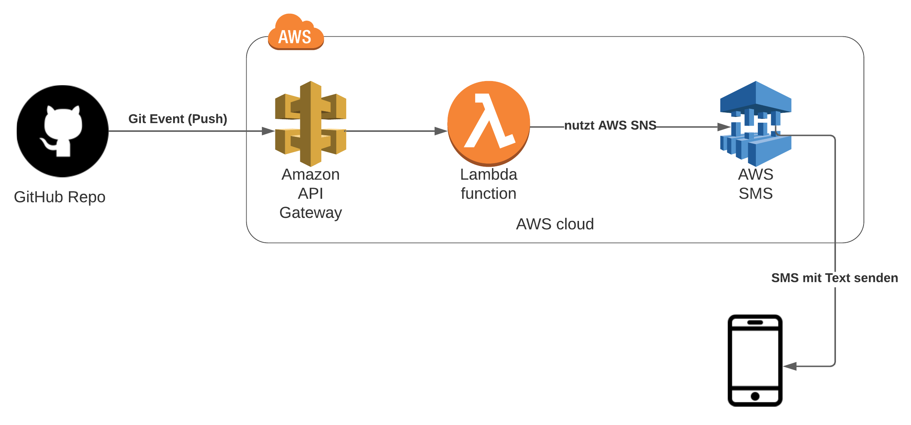

Es wird ein Git Repository mit GitHub eingerichtet.
Dort wird ein Webhook erstellt welches bei einem Push-Event einen HTTP-Request gegen eine definierte URL stellt.
Diese URL wird von einem in der AWS laufenden API Gateway sein.
Das Gateway reicht den Request mittels Proxy Pass, nötig um den Body zu behalten, an eine Lambda Funktion weiter.
Diese nutzt die AWS SDK um mittels SNS eine SMS an eine definierte Rufnummer zu versenden.

## Aufsetzen

### Source Code Compilieren

> Nur notwendig wenn Änderungen am Code vorgenommen wurden.

Es muss Go auf dem entsprechenden System installiert sein.
Installationsanweisungen können hier gefunden werden.
https://golang.org/doc/install

Nun muss in den Ordner `./cc3-aws/github-webhook-lambda-sns/sms-sender` navigiert werden.
Dort wird der folgende Befehl ausgeführt:

```bash
env GOOS=linux GOARCH=amd64 go build -o main ./main.go && zip -r main.zip main
```

Dieser Baut aus dem vorhandenen Sourcecode eine Binary für die Zielplattform `linux`.
Diese Binary mit dem Namen `main` wird als `main.zip` Archiv verpackt.

### Lambda Funktion

Als erstes muss eine Lambda Funktion erstellt werden.
Diese bekommt einen Namen und als Laufzeitumgebung `Go 1.x`.

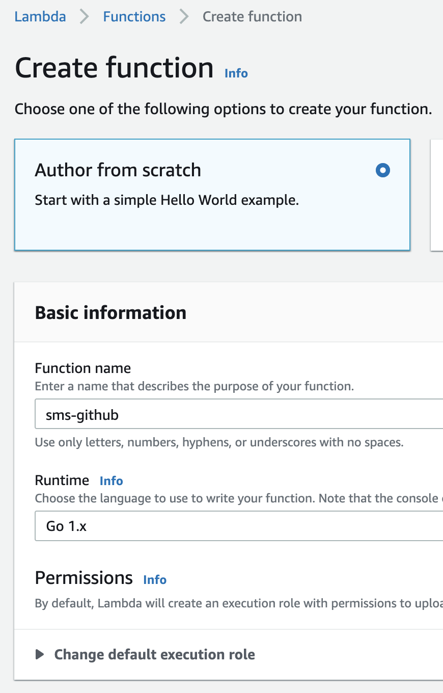

Danach muss in die Lambda navigiert werden und unter `Code` und dann `Runtime settings` oder `Laufzeiteinstellungen` der Handler geändert werden.
Der Handler ist der Einstiegspunkt der Lambda und zeigt bei Go auf die Binary.
Da die Binary `main` heißt muss der handler nun auf `main` zeigen.

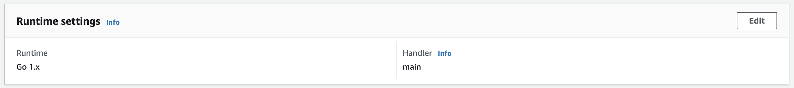

Nun muss noch die Rufnummer eingestellt werden an die am Ende die Nachricht versand werden soll.
Da die Rufnummer mittels Umgebungsvariablen definiert wurde muss unter `Konfiguration` > `Umgebungsvariablen` eine neue Variable hinzugefügt werden.
Die Variable trägt hierbei den Namen `PHONENUMBER`.

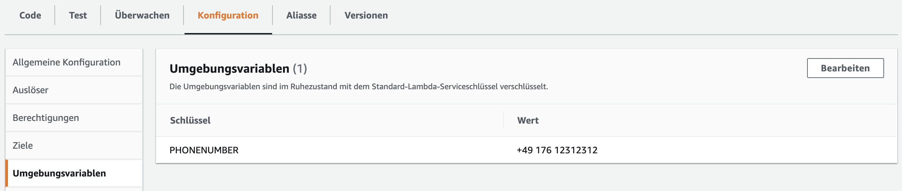

> Die Formatierung ist zu beachten.
>
> {Ländervorwahl}{Leerzeichen}{Anbiternummer OHNE Null}{Leerzeichen}{Rest}

Zuletzt muss die Lambda Funktion noch autorisiert werden auch den SNS zu nutzen.
Dafür muss unter `IAM` > `Rollen` die Rolle der Lambdafunktion herausgesucht werden.
Diese Rolle beinhaltet immer den Namen der Funktion z.B. `sms-github-role-4554dc8i`.

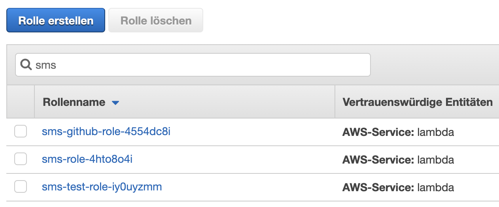

Durch das klicken auf `Richtlinien anfügen` können weitere Berechtigungen erteilt werden.

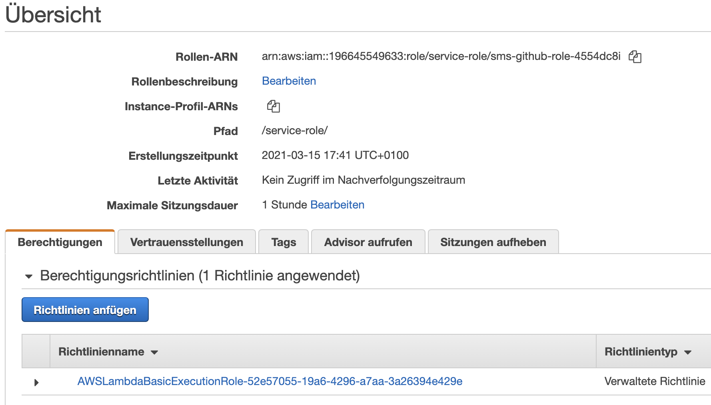

Dann muss die Richtlinie `AmazonSNSFullAccess` hinzugefügt werden.

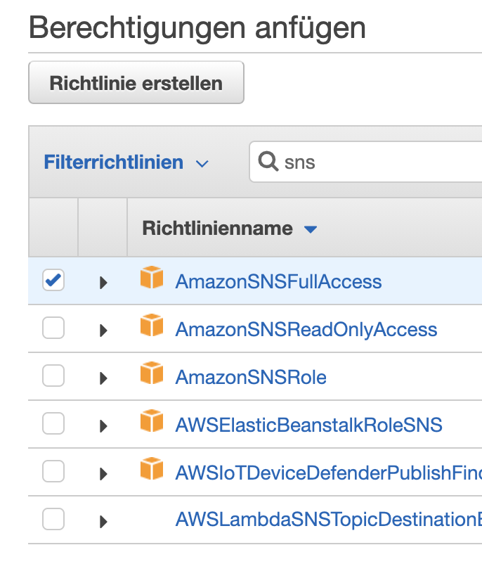

Danach kann in der Lambdafunktion unter dem Reiter `Code` mit dem Button `Hochladen von` die erstellte / vorhandene ZIP-Datei hochgeladen werden.
Die Lambda Funktion ist nun fertig aufgesetzt.

### API Gateway 

Es muss ein NICHT privates API Gateway im REST API Modus erstellt werden.
Diesem kann dann ein Name gegeben werden z.B. `sms`.

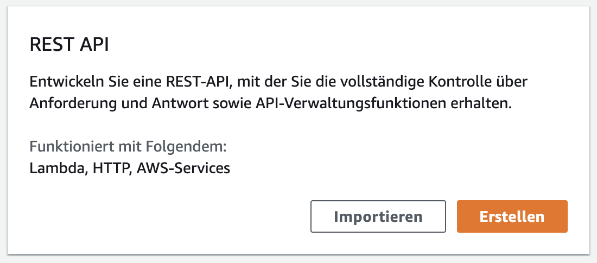

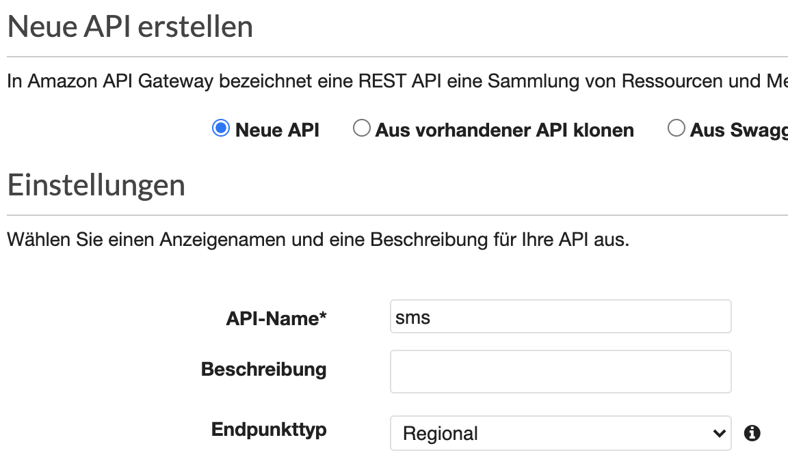

Daraufhin wird unter dem Root verzeichnis eine neue Methode mit dem Typen `ANY` angelegt, um alle Requests abzufangen.
Dort muss dann die vorher erstellte Lambda Funktion angegeben und `Lambda-Proxy-Integration verwenden` muss gesetzt werden.
Dadurch kann man den Body und weitere REST spezifiche Dinge in der Lambda abfragen.
In diesem Fall ist nur der Body wichtig, da hier nur schnell gecheckt wird ob dieser von GitHub stammt.

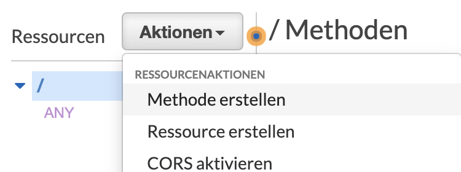

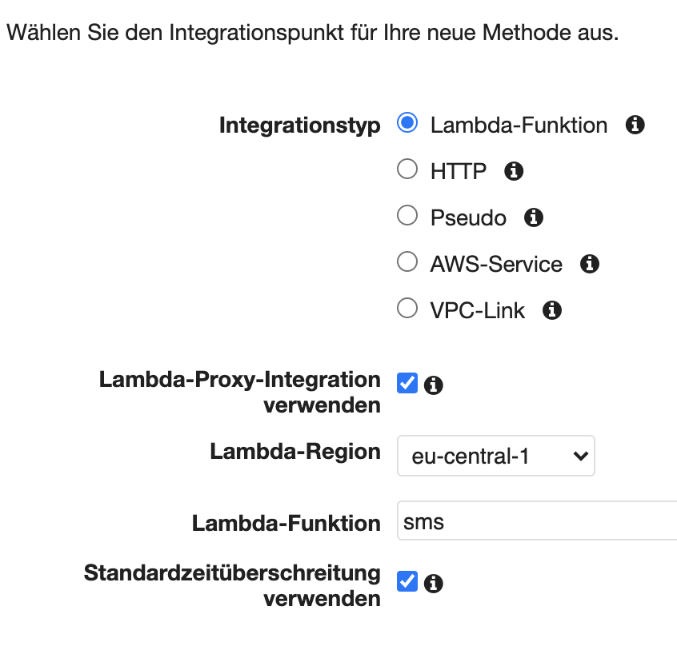

Danach muss unter `Aktionen` > `API bereitstellen` die API veröffentlicht werden.
Der Stage oder Stufen name ist hierbei egal.

Auf der Stufenseite kann dann die URL abgelesen werden.

Sie kann z.B. die Form haben `https://rmhq5cl5e9.execute-api.eu-central-1.amazonaws.com/test`.
Wobei der Präfix `/test` der Name der Stufe ist.

### GitHub Webhook

Vorraussetzung hier ist ein kostenloser GitHub Account.
Danach muss ein Repository unter `+` > `New repository` angelegt werden. 
Dieses kann public oder private sein, das spielt keine Rolle.

Nun kann in dem Repo unter `Settings` > `Webhooks` > `Add webhook` ein neuer Webhook angelegt werden.

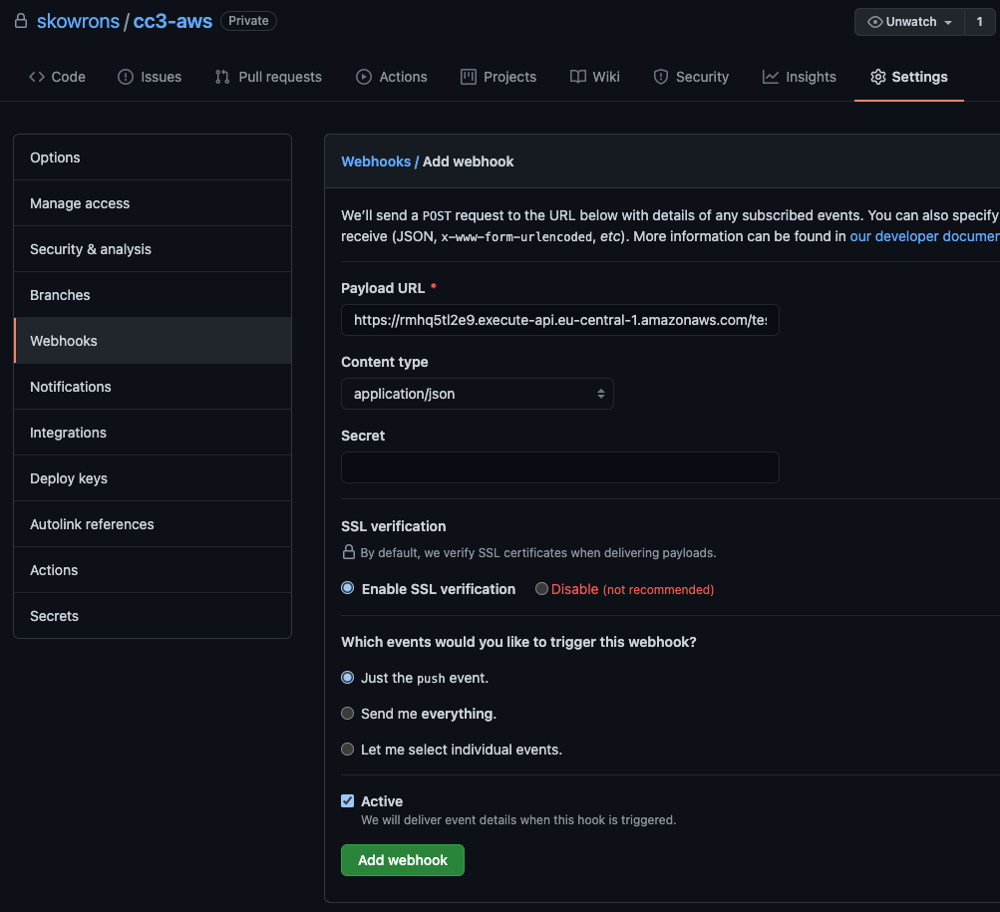

Dort wird nun die URL des API Gateways bzw. der spezifischen Stage eingetragen.
Der Content-Type wird auf JSON gesetzt.
Die Einstellung für `Just the push event.` kann so bleiben.
Möchte man auf andere Events hören empfiehlt sich die dritte Einstellungsmöglichkeit mit der genausten beschrieben werden kann wann ein Webhook starten soll.

GitHub ist nun eingerichtet.

## Testen

Die App Filtert momentan nach dem String "github".
Dieser ist natürlich in jedem Body von einem GitHub Webhook irgendwo enthalten.
Somit sollte folgender curl Befehl einen 200 returnen und die Message `sms will be send`.
Danach sollte zeitnahe die SMS ankommen.

```bash
curl -X POST https://rmhq5tl2e9.execute-api.eu-central-1.amazonaws.com/test -d "github"
```

Der Befehl ohne Body sollte einen 400 Status Code und die Message `sms will not be send` zurückgeben.

```bash
curl -X POST https://rmhq5tl2e9.execute-api.eu-central-1.amazonaws.com/test -v
```

## Probleme 

### Request Body auslesen

Um hinter einem API Gateway in einer Lambda Funktion den Request Body auszulesen muss der Proxy Modus aktiviert sein.
Zusätzlich wird dann aber gefordert einen speziell definierten Response zurückzugeben.
Bei Go konnte das Package `github.com/aws/aws-lambda-go` verwendet werden, welches Objekte definiert für Proxy Request und Response.

## Erweiterungspotential

Lambdas und SMS-Nachrichten können in verschiedenen weiteren Kontexten im DevOps Bereich benutzt werden.
So könnte wenn eine wichtige Jenkins oder GitHub Actions Pipeline fehlschlägt eine SMS an den Repository-, DevOps-Verantwortlichen oder Tech Lead geschickt werden.
Entsprechende Nummern könnten dann in einer DB gespeichert werden und dynamisch ausgelesen werden.

Auch sollte der Endpunkt abgesichert werden mittels eines Tokens oder Secrets, um Missbrauch auszuschließen und die daraus folgenden Kosten.